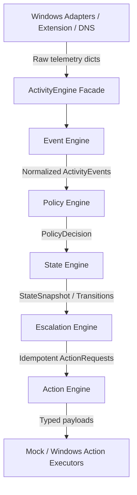

# Architecture Guide

This module is built using Clean Architecture combined with Hexagonal Architecture (Ports & Adapters).

## Packages

- **`core/`**: Platform-independent business logic (events, policies, state machine, errors).
- **`domain/`**: Aggregates and entities (monitoring sessions, current activity aggregate, violations).
- **`engine/`**: Pipeline processing nodes.
- **`ports/`**: Protocol/interfaces for monitors and executors.
- **`adapters/`**: Real and mock implementations of ports.
- **`services/`**: Coordination of multiple engines (Focus, Bedtime, Polling).
- **`transport/`**: Wire serialization contracts for websocket streams.